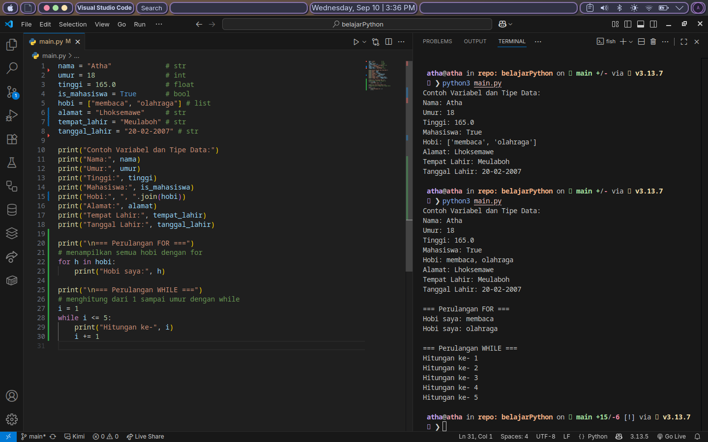

# Contoh Variabel, Tipe Data, dan Perulangan di Python

Project ini berisi contoh penggunaan **variabel**, **tipe data dasar**, serta **perulangan** (`for` dan `while`) pada bahasa pemrograman Python.  
Cocok untuk pemula yang baru belajar Python.

---

## Isi Program
1. **Variabel & Tipe Data**  
   - `str`  → String (contoh: nama, alamat, tempat_lahir, tanggal_lahir)  
   - `int`  → Integer (contoh: umur)  
   - `float` → Floating Point (contoh: tinggi)  
   - `bool` → Boolean (contoh: is_mahasiswa)  
   - `list` → Daftar (contoh: hobi)  

2. **Perulangan**  
   - `for` digunakan untuk menampilkan isi dari list `hobi`.  
   - `while` digunakan untuk menampilkan hitungan sederhana.

---

### hasil belajar day 1
